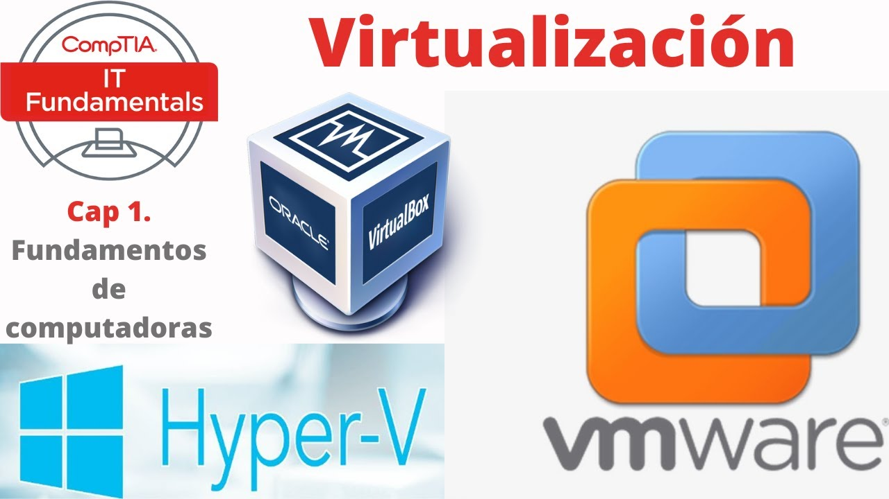

# Tipos de Virtualización

La virtualización se puede clasificar en dos grandes categorías según el nivel en el que actúa:

---

## 1. **Virtualización basada en Hardware**
La virtualización que trabaja directamente sobre el hardware físico mediante un **hipervisor**. Este tipo permite crear múltiples máquinas virtuales (VM) aisladas, cada una con su propio sistema operativo.

- **Ventaja**: Alta eficiencia en el uso de recursos.
- **Ejemplos**:
  - VMware vSphere
  - Microsoft Hyper-V
  - KVM (Kernel-based Virtual Machine)

---

## 2. **Virtualización basada en Software**
En este tipo, la virtualización se gestiona a nivel de **software**, enfocándose en recursos como aplicaciones, escritorios o contenedores. No es necesario un hipervisor completo, sino que se virtualizan recursos dentro del sistema operativo.

- **Ventaja**: Flexibilidad y escalabilidad.
- **Ejemplos**:
  - VMware ThinApp (para aplicaciones)
  - Citrix XenDesktop (para escritorios)
  - Docker (para contenedores)

---

Ambos tipos tienen el mismo objetivo: **optimizar el uso de recursos**. Sin embargo, se diferencian en el nivel en que operan: **hardware** o **software**.

